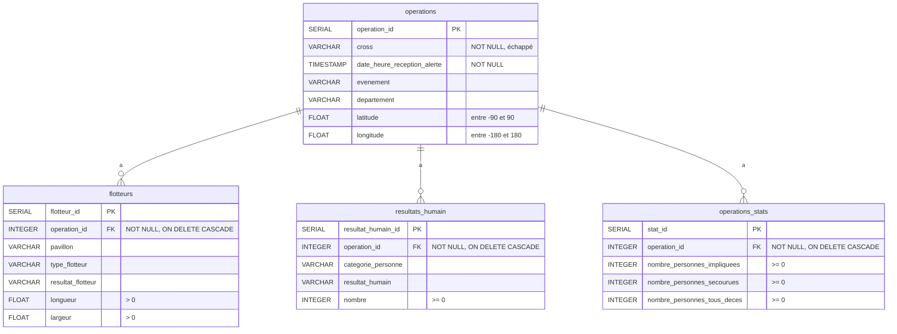

# 🏗️ Architecture de l'Application - Grass Squad SECMAR

## Vue d'Ensemble

Application Streamlit multi-pages pour la gestion complète des opérations maritimes SECMAR avec validation Pandera et base de données PostgreSQL.

---

## 📐 Architecture Technique

### Modèle : MVC Adapté pour Streamlit

```
┌─────────────────────────────────────────────────────────┐
│                    PRESENTATION (View)                   │
│  ┌───────────────────────────────────────────────────┐  │
│  │              Streamlit Pages                       │  │
│  │  - home.py (Page d'accueil)                       │  │
│  │  - 01_Dashboard.py (KPIs & Visualisations)        │  │
│  │  - 02_Gestion_Donnees.py (Édition rapide)         │  │
│  │  - 03_Audit.py (Logs & ERD)                       │  │
│  │  - 04_Consultation_Operations.py (Lecture)        │  │
│  │  - 05_CRUD_Complet.py (Créer/Modifier/Supprimer) │  │
│  └───────────────────────────────────────────────────┘  │
└──────────────────┬──────────────────────────────────────┘
                   │
                   ▼
┌─────────────────────────────────────────────────────────┐
│                   BUSINESS LOGIC                         │
│  ┌───────────────────────────────────────────────────┐  │
│  │           CRUD Operations (Controller)            │  │
│  │  - operations_crud.py                             │  │
│  │  - flotteurs_crud.py                              │  │
│  │  - resultat_humain_crud.py                        │  │
│  │  - operations_stats_crud.py                       │  │
│  │  - audit_crud.py                                  │  │
│  └───────────────────────────────────────────────────┘  │
│  ┌───────────────────────────────────────────────────┐  │
│  │           Validation (Pandera)                    │  │
│  │  - pandera_schemas.py                             │  │
│  │    * operations_schema                            │  │
│  │    * flotteurs_schema                             │  │
│  │    * resultats_humain_schema                      │  │
│  │    * operations_stats_schema                      │  │
│  └───────────────────────────────────────────────────┘  │
└──────────────────┬──────────────────────────────────────┘
                   │
                   ▼
┌─────────────────────────────────────────────────────────┐
│                   DATA ACCESS LAYER                      │
│  ┌───────────────────────────────────────────────────┐  │
│  │         Database Connection Manager               │  │
│  │  - load_database.py                               │  │
│  │    * get_db_connection() → psycopg2 connection   │  │
│  │    * engine → SQLAlchemy engine                   │  │
│  └───────────────────────────────────────────────────┘  │
└──────────────────┬──────────────────────────────────────┘
                   │
                   ▼
┌─────────────────────────────────────────────────────────┐
│                   DATABASE (Model)                       │
│  ┌───────────────────────────────────────────────────┐  │
│  │              PostgreSQL Tables                    │  │
│  │  - operations (table principale)                  │  │
│  │  - flotteurs (FK: operation_id)                   │  │
│  │  - resultats_humain (FK: operation_id)            │  │
│  │  - operations_stats (FK: operation_id)            │  │
│  │  - audit_log (logs automatiques)                  │  │
│  └───────────────────────────────────────────────────┘  │
└─────────────────────────────────────────────────────────┘
```

---

## 🗂️ Structure des Dossiers

```
Brief-3-Gestion-donnees-et-UI-analytique-polyvalente-Grass-Squad/
│
├── 📁 src/                          # Code source
│   │
│   ├── 📁 app/                      # Application Streamlit
│   │   ├── 📄 home.py               # 🏠 Page d'accueil (entry point)
│   │   │   ├── Titre & présentation
│   │   │   ├── 4 métriques (ops, secourus, flotteurs, logs)
│   │   │   ├── 5 dernières opérations
│   │   │   └── Vérification connexion DB
│   │   │
│   │   └── 📁 pages/                # Pages supplémentaires (auto-découverte)
│   │       ├── 📄 01_Dashboard.py   # KPIs, carte géolocalisée
│   │       ├── 📄 02_Gestion_Donnees.py  # Édition rapide avec data_editor
│   │       ├── 📄 03_Audit.py       # Logs d'audit & ERD Mermaid
│   │       ├── 📄 04_Consultation_Operations.py  # Lecture avec filtres
│   │       └── 📄 05_CRUD_Complet.py  # CRUD avec validation Pandera
│   │
│   ├── 📁 crud/                     # Opérations CRUD (Data Access)
│   │   ├── 📄 operations_crud.py    # insert_operation, update_operation, etc.
│   │   ├── 📄 flotteurs_crud.py     # insert_flotteur, delete_flotteur
│   │   ├── 📄 resultat_humain_crud.py  # insert_resultat_humain
│   │   ├── 📄 operations_stats_crud.py  # insert_operations_stats
│   │   └── 📄 audit_crud.py         # log_action (automatique via triggers)
│   │
│   ├── 📁 database/                 # Configuration & schémas DB
│   │   ├── 📄 load_database.py      # Connexion PostgreSQL
│   │   │   ├── get_db_connection() → psycopg2 connection
│   │   │   ├── engine → SQLAlchemy engine (pour pandas)
│   │   │   └── create_tables() → Création des tables
│   │   ├── 📄 database.sql          # Schéma complet (CREATE TABLE)
│   │   └── 📄 audit.sql             # Triggers pour audit_log
│   │
│   ├── 📁 validation/               # Validation de données
│   │   ├── 📄 schemas_validation.py  # Schémas originaux
│   │   └── 📄 pandera_schemas.py    # 🆕 Schémas Pandera
│   │       ├── operations_schema
│   │       ├── flotteurs_schema
│   │       ├── resultats_humain_schema
│   │       ├── operations_stats_schema
│   │       └── validate_dataframe()
│   │
│   ├── 📁 ingestion/                # Chargement de données
│   │   ├── 📄 load_raw_data.py
│   │   └── 📄 functions_io.py
│   │
│   ├── 📁 cleaning/                 # Transformation de données
│   │   └── 📄 transformation.py
│   │
│   └── 📁 analysis/                 # Analyses & graphiques
│
├── 📁 data/                         # Données brutes & traitées
│   ├── 📁 raw/                      # CSV bruts (flotteurs, operations, etc.)
│   ├── 📁 processed/                # CSV nettoyés
│   └── 📁 rejected/                 # Données invalides
│
├── 📁 docs/                         # Documentation
│
├── 📁 tests/                        # Tests unitaires & intégration
│
├── 📄 requirements.txt              # Dépendances Python
├── 📄 .env                          # Variables d'environnement (DB_*)
├── 📄 run_pipeline.py               # Script de chargement complet
├── 📄 README.md                     # README principal
├── 📄 README_APPLICATION.md         # 🆕 Documentation complète de l'app
└── 📄 GUIDE_UTILISATION.md          # 🆕 Guide utilisateur détaillé
```

---

## 🔄 Flux de Données

### 1️⃣ Flux de CRÉATION (INSERT)

```
┌────────────────────────────────────────────────────────┐
│  05_CRUD_Complet.py                                    │
│  ┌──────────────────────────────────────────────────┐ │
│  │  Formulaire "Créer une opération"                │ │
│  │  - User remplit les champs                       │ │
│  │  - Click sur "Créer l'opération complète"        │ │
│  └────────────────┬─────────────────────────────────┘ │
└───────────────────┼────────────────────────────────────┘
                    │
                    ▼
┌────────────────────────────────────────────────────────┐
│  pandera_schemas.py                                    │
│  ┌──────────────────────────────────────────────────┐ │
│  │  validate_operations_data(data_dict)             │ │
│  │  - Vérification des types (str, DateTime, float) │ │
│  │  - Vérification NOT NULL (cross, date)           │ │
│  │  - Vérification des plages (lat, lon)            │ │
│  │  - Retourne (validated_df, errors)               │ │
│  └────────────────┬─────────────────────────────────┘ │
└───────────────────┼────────────────────────────────────┘
                    │
                    ▼ (si validation OK)
┌────────────────────────────────────────────────────────┐
│  operations_crud.py                                    │
│  ┌──────────────────────────────────────────────────┐ │
│  │  insert_operation(operation_data)                │ │
│  │  - Prépare la requête SQL INSERT                 │ │
│  │  - Échappe "cross" → "cross"                     │ │
│  │  - Execute avec psycopg2                         │ │
│  │  - Retourne operation_id (auto-généré)           │ │
│  └────────────────┬─────────────────────────────────┘ │
└───────────────────┼────────────────────────────────────┘
                    │
                    ▼
┌────────────────────────────────────────────────────────┐
│  load_database.py                                      │
│  ┌──────────────────────────────────────────────────┐ │
│  │  get_db_connection()                             │ │
│  │  - Retourne psycopg2 connection                  │ │
│  │  - Utilisé par toutes les fonctions CRUD         │ │
│  └────────────────┬─────────────────────────────────┘ │
└───────────────────┼────────────────────────────────────┘
                    │
                    ▼
┌────────────────────────────────────────────────────────┐
│  PostgreSQL Database                                   │
│  ┌──────────────────────────────────────────────────┐ │
│  │  INSERT INTO operations ("cross", ...) VALUES ... │ │
│  │  RETURNING operation_id;                         │ │
│  └────────────────┬─────────────────────────────────┘ │
│  ┌──────────────────────────────────────────────────┐ │
│  │  Trigger → INSERT INTO audit_log                 │ │
│  │  (table_name='operations', action='CREATE', ...) │ │
│  └──────────────────────────────────────────────────┘ │
└────────────────────────────────────────────────────────┘
                    │
                    ▼
┌────────────────────────────────────────────────────────┐
│  Si flotteur, résultats humains ou stats ajoutés :    │
│  ┌──────────────────────────────────────────────────┐ │
│  │  insert_flotteur(flotteur_data)                  │ │
│  │  insert_resultat_humain(humain_data)             │ │
│  │  insert_operations_stats(stats_data)             │ │
│  │  - Tous utilisent le même operation_id           │ │
│  └──────────────────────────────────────────────────┘ │
└────────────────────────────────────────────────────────┘
                    │
                    ▼
┌────────────────────────────────────────────────────────┐
│  Retour à 05_CRUD_Complet.py                          │
│  ┌──────────────────────────────────────────────────┐ │
│  │  st.success("✅ Opération créée !")              │ │
│  │  st.success("✅ Flotteur ajouté !")              │ │
│  │  st.balloons()                                   │ │
│  └──────────────────────────────────────────────────┘ │
└────────────────────────────────────────────────────────┘
```

### 2️⃣ Flux de CONSULTATION (SELECT)

```
┌────────────────────────────────────────────────────────┐
│  04_Consultation_Operations.py                         │
│  ┌──────────────────────────────────────────────────┐ │
│  │  User sélectionne une opération dans sidebar     │ │
│  │  selected_op = st.sidebar.selectbox(...)         │ │
│  └────────────────┬─────────────────────────────────┘ │
└───────────────────┼────────────────────────────────────┘
                    │
                    ▼
┌────────────────────────────────────────────────────────┐
│  SQLAlchemy Engine (pour pandas)                       │
│  ┌──────────────────────────────────────────────────┐ │
│  │  query = f"SELECT * FROM operations WHERE ..."   │ │
│  │  df_op = pd.read_sql(query, engine)              │ │
│  │  - Pas de warning (SQLAlchemy connectable)       │ │
│  └────────────────┬─────────────────────────────────┘ │
└───────────────────┼────────────────────────────────────┘
                    │
                    ▼
┌────────────────────────────────────────────────────────┐
│  Récupération des données liées en parallèle           │
│  ┌──────────────────────────────────────────────────┐ │
│  │  df_flotteurs = pd.read_sql(query_flotteurs, engine) │
│  │  df_humain = pd.read_sql(query_humain, engine)   │ │
│  │  df_stats = pd.read_sql(query_stats, engine)     │ │
│  └────────────────┬─────────────────────────────────┘ │
└───────────────────┼────────────────────────────────────┘
                    │
                    ▼
┌────────────────────────────────────────────────────────┐
│  Affichage dans Streamlit                              │
│  ┌──────────────────────────────────────────────────┐ │
│  │  st.tabs(["Opération", "Flotteurs", ...])        │ │
│  │  st.dataframe(df_op)                             │ │
│  │  st.dataframe(df_flotteurs)                      │ │
│  │  st.metric("Personnes secourues", nb_secourues)  │ │
│  └──────────────────────────────────────────────────┘ │
└────────────────────────────────────────────────────────┘
```

### 3️⃣ Flux de MODIFICATION (UPDATE)

```
┌────────────────────────────────────────────────────────┐
│  05_CRUD_Complet.py (ou 02_Gestion_Donnees.py)        │
│  ┌──────────────────────────────────────────────────┐ │
│  │  edited_op = st.data_editor(df_op)               │ │
│  │  User modifie une cellule                        │ │
│  │  Click sur "Sauvegarder les modifications"       │ │
│  └────────────────┬─────────────────────────────────┘ │
└───────────────────┼────────────────────────────────────┘
                    │
                    ▼
┌────────────────────────────────────────────────────────┐
│  Validation des champs obligatoires                    │
│  ┌──────────────────────────────────────────────────┐ │
│  │  if edited_op['cross'].isna().any():             │ │
│  │      st.error("CROSS ne peut pas être vide")     │ │
│  │      return                                      │ │
│  └────────────────┬─────────────────────────────────┘ │
└───────────────────┼────────────────────────────────────┘
                    │
                    ▼ (si validation OK)
┌────────────────────────────────────────────────────────┐
│  Exécution des requêtes UPDATE                         │
│  ┌──────────────────────────────────────────────────┐ │
│  │  conn = get_db_connection()                      │ │
│  │  cur = conn.cursor()                             │ │
│  │  for col in edited_op.columns:                   │ │
│  │      if col == "cross":                          │ │
│  │          UPDATE operations SET "cross" = %s ...  │ │
│  │      else:                                       │ │
│  │          UPDATE operations SET col = %s ...      │ │
│  │  conn.commit()                                   │ │
│  └────────────────┬─────────────────────────────────┘ │
└───────────────────┼────────────────────────────────────┘
                    │
                    ▼
┌────────────────────────────────────────────────────────┐
│  PostgreSQL Database                                   │
│  ┌──────────────────────────────────────────────────┐ │
│  │  UPDATE operations SET "cross" = 'Med' WHERE ... │ │
│  └────────────────┬─────────────────────────────────┘ │
│  ┌──────────────────────────────────────────────────┐ │
│  │  Trigger → INSERT INTO audit_log                 │ │
│  │  (action='UPDATE', record_id=123, ...)           │ │
│  └──────────────────────────────────────────────────┘ │
└────────────────────────────────────────────────────────┘
                    │
                    ▼
┌────────────────────────────────────────────────────────┐
│  Retour à Streamlit                                    │
│  ┌──────────────────────────────────────────────────┐ │
│  │  st.success("✅ Modification réussie !")         │ │
│  │  st.rerun() → Rafraîchir la page                 │ │
│  └──────────────────────────────────────────────────┘ │
└────────────────────────────────────────────────────────┘
```

### 4️⃣ Flux de SUPPRESSION (DELETE)

```
┌────────────────────────────────────────────────────────┐
│  05_CRUD_Complet.py                                    │
│  ┌──────────────────────────────────────────────────┐ │
│  │  User sélectionne une opération                  │ │
│  │  Affichage de l'aperçu (opération + nb données)  │ │
│  │  confirm = st.checkbox("Je confirme...")         │ │
│  │  Click sur "SUPPRIMER DÉFINITIVEMENT"            │ │
│  └────────────────┬─────────────────────────────────┘ │
└───────────────────┼────────────────────────────────────┘
                    │
                    ▼
┌────────────────────────────────────────────────────────┐
│  Suppression en cascade (dans l'ordre)                 │
│  ┌──────────────────────────────────────────────────┐ │
│  │  conn = get_db_connection()                      │ │
│  │  cur = conn.cursor()                             │ │
│  │  1. DELETE FROM operations_stats WHERE op_id=... │ │
│  │  2. DELETE FROM resultats_humain WHERE op_id=... │ │
│  │  3. DELETE FROM flotteurs WHERE op_id=...        │ │
│  │  4. DELETE FROM operations WHERE op_id=...       │ │
│  │  conn.commit()                                   │ │
│  └────────────────┬─────────────────────────────────┘ │
└───────────────────┼────────────────────────────────────┘
                    │
                    ▼
┌────────────────────────────────────────────────────────┐
│  PostgreSQL Database                                   │
│  ┌──────────────────────────────────────────────────┐ │
│  │  Grâce à ON DELETE CASCADE :                     │ │
│  │  - Les FK assurent la suppression automatique    │ │
│  │  - Si opération supprimée → toutes données liées │ │
│  │    sont supprimées automatiquement               │ │
│  └────────────────┬─────────────────────────────────┘ │
│  ┌──────────────────────────────────────────────────┐ │
│  │  Trigger → INSERT INTO audit_log                 │ │
│  │  (action='DELETE', record_id=123, ...)           │ │
│  └──────────────────────────────────────────────────┘ │
└────────────────────────────────────────────────────────┘
                    │
                    ▼
┌────────────────────────────────────────────────────────┐
│  Retour à Streamlit                                    │
│  ┌──────────────────────────────────────────────────┐ │
│  │  st.success("✅ Suppression réussie !")          │ │
│  │  st.balloons()                                   │ │
│  │  time.sleep(2) → Pause pour voir le message      │ │
│  │  st.rerun() → Rafraîchir la liste                │ │
│  └──────────────────────────────────────────────────┘ │
└────────────────────────────────────────────────────────┘
```

---

## 🔌 Connexions à la Base de Données

### Deux types de connexions

#### 1. **psycopg2 Connection** (pour CRUD)

```python
# src/database/load_database.py
def get_db_connection():
    return psycopg2.connect(
        host=os.getenv("DB_HOST"),
        port=os.getenv("DB_PORT"),
        user=os.getenv("DB_USER"),
        password=os.getenv("DB_PASSWORD"),
        database=os.getenv("DB_NAME")
    )

# Utilisation dans les CRUD
conn = get_db_connection()
cur = conn.cursor()
cur.execute("INSERT INTO operations (...) VALUES (...)")
conn.commit()
cur.close()
conn.close()
```

**Avantages** :
- Contrôle total sur les transactions
- Requêtes paramétrées sécurisées
- Fermeture explicite de la connexion

**Inconvénients** :
- Pandas génère un warning si utilisé avec `pd.read_sql()`

#### 2. **SQLAlchemy Engine** (pour pandas)

```python
# src/database/load_database.py
from sqlalchemy import create_engine

engine = create_engine(
    f"postgresql://{user}:{password}@{host}:{port}/{database}"
)

# Utilisation avec pandas
df = pd.read_sql("SELECT * FROM operations", engine)
```

**Avantages** :
- Pas de warning avec pandas
- ORM possible (non utilisé ici)
- Pool de connexions automatique

**Inconvénients** :
- Moins de contrôle sur les transactions individuelles

### Stratégie adoptée

- **CRUD (INSERT, UPDATE, DELETE)** → `get_db_connection()` (psycopg2)
- **Lectures avec pandas (SELECT)** → `engine` (SQLAlchemy)

---

## 🛡️ Validation Pandera

### Schémas définis

#### operations_schema

```python
operations_schema = DataFrameSchema({
    "cross": Column(str, Check.str_length(min_value=1, max_value=50), nullable=False),
    "date_heure_reception_alerte": Column(pa.DateTime, nullable=False),
    "latitude": Column(float, Check.in_range(-90, 90), nullable=True),
    "longitude": Column(float, Check.in_range(-180, 180), nullable=True),
    # ... autres colonnes
}, strict=False)
```

#### flotteurs_schema

```python
flotteurs_schema = DataFrameSchema({
    "operation_id": Column(int, nullable=False),
    "longueur": Column(float, Check.greater_than(0), nullable=True),
    "largeur": Column(float, Check.greater_than(0), nullable=True),
    # ... autres colonnes
}, strict=False)
```

### Utilisation

```python
# Dans 05_CRUD_Complet.py
from src.validation.pandera_schemas import validate_operations_data

data = {
    "cross": cross,
    "date_heure_reception_alerte": datetime.combine(date_alerte, heure_alerte),
    # ...
}

validated_df, errors = validate_operations_data(data)

if errors:
    for error in errors:
        st.error(f"❌ {error['column']}: {error['check']}")
else:
    # Procéder à l'insertion
    operation_id = insert_operation(data)
```

---

## 🗺️ Diagramme ERD (Entity Relationship Diagram)



---

## 🧩 Composants Clés

### 1. Pages Streamlit

| Page | Rôle | Composants principaux |
|------|------|----------------------|
| `home.py` | Accueil & aperçu | `st.metric()`, `st.dataframe()`, connexion DB |
| `01_Dashboard.py` | KPIs & carte | `st.metric()`, cartes géolocalisées |
| `02_Gestion_Donnees.py` | Édition rapide | `st.data_editor()`, validation |
| `03_Audit.py` | Logs & ERD | `st.dataframe()`, `streamlit_mermaid` |
| `04_Consultation_Operations.py` | Lecture avec filtres | `st.selectbox()`, `st.tabs()`, `st.dataframe()` |
| `05_CRUD_Complet.py` | CRUD complet | `st.form()`, `st.radio()`, validation Pandera |

### 2. Fonctions CRUD

| Fichier | Fonctions | Responsabilité |
|---------|-----------|----------------|
| `operations_crud.py` | `insert_operation`, `update_operation`, `delete_operation` | CRUD opérations |
| `flotteurs_crud.py` | `insert_flotteur`, `delete_flotteur` | CRUD flotteurs |
| `resultat_humain_crud.py` | `insert_resultat_humain` | CRUD résultats humains |
| `operations_stats_crud.py` | `insert_operations_stats` | CRUD statistiques |
| `audit_crud.py` | `log_action` (via triggers) | Logs automatiques |

### 3. Validation

| Schéma | Tables couvertes | Contraintes |
|--------|------------------|-------------|
| `operations_schema` | operations | Types, NOT NULL, plages lat/lon |
| `flotteurs_schema` | flotteurs | Types, longueur/largeur > 0 |
| `resultats_humain_schema` | resultats_humain | Types, nombre >= 0 |
| `operations_stats_schema` | operations_stats | Types, tous compteurs >= 0 |

---

## 🔒 Sécurité

### 1. SQL Injection Prevention

✅ **Requêtes paramétrées** :
```python
cur.execute("INSERT INTO operations (cross, ...) VALUES (%s, ...)", (cross, ...))
```

❌ **Éviter** :
```python
cur.execute(f"INSERT INTO operations VALUES ('{cross}', ...)")  # DANGER !
```

### 2. Échappement du mot-clé "cross"

```python
# Toujours échapper avec guillemets doubles
query = 'SELECT "cross" FROM operations'
```

### 3. Validation des entrées

- Pandera vérifie les types avant insertion
- Contraintes NOT NULL en DB
- Vérification des plages (latitude, longitude, nombres positifs)

---

## 📊 Métriques & KPIs

### Métriques affichées

| Métrique | Requête SQL | Affichage |
|----------|-------------|-----------|
| Total opérations | `SELECT COUNT(*) FROM operations` | `st.metric("Opérations", total)` |
| Personnes secourues | `SELECT SUM(nombre_personnes_secourues) FROM operations_stats` | `st.metric("Secourus", total)` |
| Total flotteurs | `SELECT COUNT(*) FROM flotteurs` | `st.metric("Flotteurs", total)` |
| Logs d'audit | `SELECT COUNT(*) FROM audit_log` | `st.metric("Logs", total)` |

---

## 🚀 Optimisations Possibles

### Performance

1. **Index DB** :
   ```sql
   CREATE INDEX idx_operation_id ON flotteurs(operation_id);
   CREATE INDEX idx_cross ON operations("cross");
   CREATE INDEX idx_date ON operations(date_heure_reception_alerte);
   ```

2. **Cache Streamlit** :
   ```python
   @st.cache_data(ttl=300)  # Cache 5 minutes
   def get_operations():
       return pd.read_sql("SELECT * FROM operations", engine)
   ```

3. **Pagination** :
   ```python
   LIMIT = 100
   OFFSET = page * LIMIT
   query = f"SELECT * FROM operations LIMIT {LIMIT} OFFSET {OFFSET}"
   ```

### UX

1. **Loading spinners** :
   ```python
   with st.spinner("Chargement..."):
       df = pd.read_sql(query, engine)
   ```

2. **Messages de feedback** :
   ```python
   st.toast("✅ Opération créée !", icon="✅")
   ```

---

## 📝 Logs & Audit

### Table audit_log

```sql
CREATE TABLE audit_log (
    id SERIAL PRIMARY KEY,
    table_name VARCHAR(50),
    action VARCHAR(10),  -- 'CREATE', 'UPDATE', 'DELETE'
    record_id INTEGER,
    created_at TIMESTAMP DEFAULT NOW()
);
```

### Triggers automatiques

Chaque INSERT/UPDATE/DELETE sur les tables principales déclenche un INSERT dans `audit_log`.

---

## 🎯 Conclusion

Cette architecture MVC adaptée pour Streamlit offre :

✅ **Séparation des responsabilités** :
- Presentation (Streamlit pages)
- Business Logic (CRUD + Validation)
- Data Access (load_database)
- Model (PostgreSQL)

✅ **Validation robuste** avec Pandera

✅ **Traçabilité complète** avec audit_log

✅ **Interface intuitive** pour utilisateurs non techniques

✅ **Extensibilité** facile (ajout de nouvelles pages, nouvelles tables)

---

**Développé par Grass Squad** 🌊 | **Simplon DE P1 2025**
