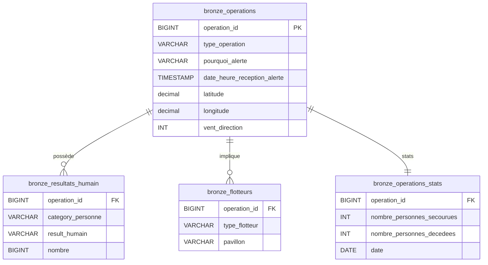

# 🚢 Pipeline ETL - Données de Sauvetage Maritime

Ce projet s'inscrit dans le cadre du **Brief 3 : Gestion de données et UI analytique polyvalente**.  
L'objectif est de concevoir une chaîne de traitement de données (ETL), d'assurer la qualité des données, et de déployer une interface utilisateur interactive pour l'exploration et la gestion opérationnelle (CRUD).

Ce projet implémente un pipeline ETL (Extract, Transform, Load) complet pour traiter et analyser les données de sauvetage maritime provenant des CROSS (Centres Régionaux Opérationnels de Surveillance et de Sauvetage).

- **Ingestion de données (ETL)** : Pipeline automatisé pour charger des fichiers CSV bruts vers PostgreSQL.
- **Base de données** : Modélisation SQL (tables Bronze/Raw).
- **Interface Streamlit** :
  - **Dashboard** : Visualisation des KPIs et cartographie des opérations.
  - **Gestion Données (CRUD)** : Éditeur interactif pour corriger les données en temps réel.
  - **Audit** : Traçabilité complète des modifications (inserts, updates, deletes).
- **Qualité & Tests** : Validation des schémas avec Pandera et tests unitaires avec Pytest.
- **Environnement moderne** : Utilisation de `uv` pour la gestion des dépendances.

## 🎯 Objectifs

- **Python** (3.13+)
- **PostgreSQL**
- **[uv](https://github.com/astral-sh/uv)**

## 📊 Sources de Données

Le pipeline traite 4 fichiers CSV principaux :

2. **Installer les dépendances**
   ```bash
   uv sync
   ```

3. **Configuration Base de Données (.env)**
   Créez un fichier `.env` à la racine :
   ```ini
   DB_NAME=db_operations
   DB_USER=postgres
   DB_PASSWORD=root
   DB_HOST=localhost
   ```

```
.
├── data/
│   ├── raw/                    # Données brutes source (CSV)
│   ├── processed/              # Données traitées et validées
│   └── rejected/               # Données rejetées lors de la validation
│
├── src/
│   ├── ingestion/              # Chargement des données brutes
│   ├── cleaning/               # Transformation et nettoyage
│   ├── validation/             # Validation avec schémas Pandera
│   ├── database/               # Scripts SQL et chargement PostgreSQL
│   ├── crud/                   # Opérations CRUD par table
│   └── config.py               # Configuration des chemins
│
├── docs/                       # Documentation du projet
├── tests/                      # Tests unitaires et d'intégration
├── run_pipeline.py             # Point d'entrée du pipeline
└── requirements.txt            # Dépendances Python
```

## ⚙️ Fonctionnement du Pipeline

Le pipeline s'exécute en **4 étapes séquentielles** :

### 1️⃣ **Ingestion**
- Chargement des 4 fichiers CSV depuis `data/raw/`
- Lecture avec gestion automatique des encodages
- Création de DataFrames Pandas

### 2️⃣ **Nettoyage**
- Standardisation des types de données
- Conversion des dates et timestamps
- Normalisation des chaînes de caractères
- Traitement des valeurs manquantes

### 3️⃣ **Validation**
- Vérification des schémas avec **Pandera**
- Contrôle de cohérence des données
- Séparation des données valides/invalides
- Export des rejets dans `data/rejected/`

### 4️⃣ **Chargement PostgreSQL**
- Création automatique des tables et schémas
- Insertion en masse avec `COPY` (performant)
- Support des types ENUM PostgreSQL
- Génération d'une table d'audit

## 🗄️ Schéma de Base de Données

Le schéma PostgreSQL `cross_sec` contient :

### Tables Principales

### 1. Ingestion des Données (ETL)
Initialisez la base de données et chargez les CSV :
```bash
# 1. Cloner le dépôt
git clone <url-du-repo>
cd Brief-3-Gestion-donnees-et-UI-analytique-polyvalente-Grass-Squad

# 2. Créer et activer l'environnement virtuel
python -m venv .venv
source .venv/bin/activate  # Linux/Mac
# .venv\Scripts\activate   # Windows

# 3. Installer les dépendances
pip install -r requirements.txt
```

### 2. Lancer l'Application Streamlit
Accédez au tableau de bord et aux outils de gestion :
```bash
uv run streamlit run src/app/main.py
```


### 3. Exécuter les Tests
Lancez la suite de tests unitaires et de validation :
```bash
uv run pytest tests/
```

## 📊 Schéma des Données

Le modèle de données est structuré autour des opérations de sauvetage. Voici le diagramme Entité-Relation :



## 🛡️ Audit et Qualité

### Audit (CDC Applicatif)
Plutôt que d'utiliser des triggers SQL opaques, l'audit est géré au niveau applicatif (Python/Streamlit) pour plus de flexibilité :
- **Table `logs_audit`** : Enregistre `action_time`, `action_type` (INSERT/UPDATE/DELETE), `user`, et les détails des modifications.
- **Logique** : La fonction `save_changes` détecte automatiquement les deltas (lignes ajoutées, modifiées, supprimées) lors de l'édition via Streamlit.

### Validation des Données (Pandera)
Un schéma de validation strict est appliqué aux données critiques :
- Vérification des types de données.
- Validation des plages de valeurs (ex: Latitude -90/+90, Direction Vent 0-360).
- Rejet automatique des fichiers invalides avant ingestion ou traitement.


## 📂 Structure du Projet

```
.
├── data/                   # Données brutes
├── src/
│   ├── app/                # Application Streamlit
│   │   ├── main.py
│   │   ├── pages/
│   │   │   ├── 01_Dashboard.py
│   │   │   ├── 02_Gestion_Donnees.py
│   │   │   └── 03_Audit.py
│   ├── crud/               # Logique métier CRUD et Audit
│   ├── db/                 # Connexion Base de Données
│   ├── etl/                # Validation et Nettoyage
│   │   ├── cleaning.py
│   │   └── validation.py
│   ├── ingestion/          # Scripts ETL initiaux
│   └── database/           # Scripts SQL initiaux
├── tests/                  # Tests Pytest
├── pyproject.toml          # Configuration du projet
└── README.md
```

### Contrôle Qualité

Les données rejetées sont automatiquement exportées dans `data/rejected/` avec horodatage pour analyse ultérieure.

## 📚 Modules Principaux

### `src/ingestion/load_raw_data.py`
Charge les 4 sources CSV et retourne un dictionnaire de DataFrames.

### `src/validation/schemas_validation.py`
Définit les schémas Pandera pour chaque table avec règles de validation strictes.

### `src/cleaning/transformation.py`
Applique les transformations et normalisations nécessaires avant validation.

### `src/database/load_database.py`
Gère la connexion PostgreSQL, création de tables et insertion des données.

### `src/crud/`
Contient les opérations CRUD spécifiques à chaque table pour manipulation après chargement.

## 🧪 Tests

```bash
# Exécuter tous les tests
pytest tests/

# Avec couverture de code
pytest --cov=src tests/
```

## 🛠️ Technologies Utilisées

| Technologie | Usage |
|-------------|-------|
| **Python 3.x** | Langage principal |
| **Pandas** | Manipulation de données |
| **Pandera** | Validation de schémas |
| **PostgreSQL** | Base de données relationnelle |
| **psycopg2** | Connecteur PostgreSQL |
| **python-dotenv** | Gestion des variables d'environnement |
| **pytest** | Framework de tests |

## 👥 Équipe - Grass Squad

Projet réalisé dans le cadre de la formation Data Engineering - Simplon 2025

## 📄 Licence

Ce projet est sous licence MIT - voir le fichier [LICENSE](LICENSE) pour plus de détails.

---

**Contact** : Pour toute question ou suggestion, veuillez ouvrir une issue sur le dépôt GitHub.