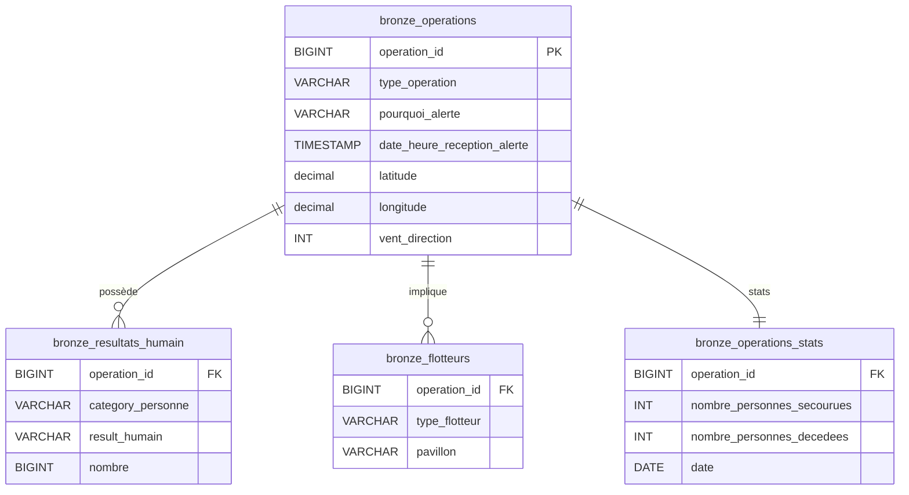

# Grass Squad - Gestion de Données et UI Analytique

Ce projet s'inscrit dans le cadre du **Brief 3 : Gestion de données et UI analytique polyvalente**.  
L'objectif est de concevoir une chaîne de traitement de données (ETL), d'assurer la qualité des données, et de déployer une interface utilisateur interactive pour l'exploration et la gestion opérationnelle (CRUD).

## 🚀 Fonctionnalités

- **Ingestion de données (ETL)** : Pipeline automatisé pour charger des fichiers CSV bruts vers PostgreSQL.
- **Base de données** : Modélisation SQL (tables Bronze/Raw).
- **Interface Streamlit** :
  - **Dashboard** : Visualisation des KPIs et cartographie des opérations.
  - **Gestion Données (CRUD)** : Éditeur interactif pour corriger les données en temps réel.
  - **Audit** : Traçabilité complète des modifications (inserts, updates, deletes).
- **Qualité & Tests** : Validation des schémas avec Pandera et tests unitaires avec Pytest.
- **Environnement moderne** : Utilisation de `uv` pour la gestion des dépendances.

## 🛠️ Pré-requis

- **Python** (3.13+)
- **PostgreSQL**
- **[uv](https://github.com/astral-sh/uv)**

## 📦 Installation et Configuration

1. **Cloner le projet**
   ```bash
   git clone <votre-url-repo>
   cd Brief-3-Gestion-donnees-et-UI-analytique-polyvalente-Grass-Squad
   ```

2. **Installer les dépendances**
   ```bash
   uv sync
   ```

3. **Configuration Base de Données (.env)**
   Créez un fichier `.env` à la racine :
   ```ini
   DB_NAME=db_operations
   DB_USER=postgres
   DB_PASSWORD=root
   DB_HOST=localhost
   ```

## ▶️ Utilisation

### 1. Ingestion des Données (ETL)
Initialisez la base de données et chargez les CSV :
```bash
uv run src/ingestion/run_full_ingestion.py
```

### 2. Lancer l'Application Streamlit
Accédez au tableau de bord et aux outils de gestion :
```bash
uv run streamlit run src/app/main.py
```


### 3. Exécuter les Tests
Lancez la suite de tests unitaires et de validation :
```bash
uv run pytest tests/
```

## 📊 Schéma des Données

Le modèle de données est structuré autour des opérations de sauvetage. Voici le diagramme Entité-Relation :



## 🛡️ Audit et Qualité

### Audit (CDC Applicatif)
Plutôt que d'utiliser des triggers SQL opaques, l'audit est géré au niveau applicatif (Python/Streamlit) pour plus de flexibilité :
- **Table `logs_audit`** : Enregistre `action_time`, `action_type` (INSERT/UPDATE/DELETE), `user`, et les détails des modifications.
- **Logique** : La fonction `save_changes` détecte automatiquement les deltas (lignes ajoutées, modifiées, supprimées) lors de l'édition via Streamlit.

### Validation des Données (Pandera)
Un schéma de validation strict est appliqué aux données critiques :
- Vérification des types de données.
- Validation des plages de valeurs (ex: Latitude -90/+90, Direction Vent 0-360).
- Rejet automatique des fichiers invalides avant ingestion ou traitement.


## 📂 Structure du Projet

```
.
├── data/                   # Données brutes
├── src/
│   ├── app/                # Application Streamlit
│   │   ├── main.py
│   │   ├── pages/
│   │   │   ├── 01_Dashboard.py
│   │   │   ├── 02_Gestion_Donnees.py
│   │   │   └── 03_Audit.py
│   ├── crud/               # Logique métier CRUD et Audit
│   ├── db/                 # Connexion Base de Données
│   ├── etl/                # Validation et Nettoyage
│   │   ├── cleaning.py
│   │   └── validation.py
│   ├── ingestion/          # Scripts ETL initiaux
│   └── database/           # Scripts SQL initiaux
├── tests/                  # Tests Pytest
├── pyproject.toml          # Configuration du projet
└── README.md
```

## 👥 Auteurs

**Grass Squad** - Simplon Dev Data