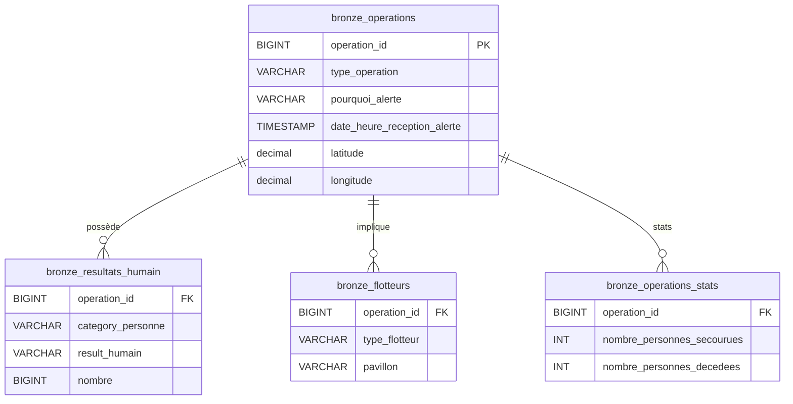

# 🚢 Pipeline ETL - Données de Sauvetage Maritime

Ce projet s'inscrit dans le cadre du **Brief 3 : Gestion de données et UI analytique polyvalente**.  
L'objectif est de concevoir une chaîne de traitement de données (ETL), d'assurer la qualité des données, et de déployer une interface utilisateur interactive pour l'exploration et la gestion opérationnelle (CRUD).

Ce projet implémente un pipeline ETL (Extract, Transform, Load) complet pour traiter et analyser les données de sauvetage maritime provenant des CROSS (Centres Régionaux Opérationnels de Surveillance et de Sauvetage).

## 🚀 Fonctionnalités Clés

- **Ingestion de données (ETL)** : Pipeline automatisé pour charger des fichiers CSV bruts vers PostgreSQL.
- **Base de données** : Modélisation SQL (tables Bronze/Raw) adaptée au reporting.
- **Interface Streamlit** :
  - **Dashboard** : Visualisation des KPIs et cartographie des opérations.
  - **Gestion Données (CRUD)** : Éditeur interactif pour corriger les données en temps réel.
  - **Audit** : Traçabilité complète des modifications (inserts, updates, deletes).
- **Qualité & Tests** : Validation des schémas avec Pandera et tests unitaires avec Pytest.
- **Environnement moderne** : Utilisation de `uv` pour la gestion des dépendances.

---

## 🛠️ Technologies Utilisées

| Technologie | Usage |
|-------------|-------|
| **Python 3.13+** | Langage principal |
| **PostgreSQL** | Base de données relationnelle |
| **[uv](https://github.com/astral-sh/uv)** | Gestionnaire de dépendances et d'environnement |
| **Pandas / Polars** | Manipulation de données |
| **Pandera** | Validation de schémas de données |
| **Streamlit** | Interface utilisateur (Dashboard & CRUD) |
| **Pytest** | Tests unitaires et d'intégration |

---

## ⚙️ Installation et Configuration

### 1. Prérequis
- Python 3.13 ou supérieur
- PostgreSQL installé et configuré
- [uv](https://docs.astral.sh/uv/) installé

### 2. Cloner le projet
```bash
git clone <url-du-repo>
cd Brief-3-Gestion-donnees-et-UI-analytique-polyvalente-Grass-Squad
```

### 3. Installer les dépendances
Utilisez `uv` pour synchroniser l'environnement :
```bash
uv sync
```
*Alternativement avec pip : `pip install -r requirements.txt`*

### 4. Configuration de la Base de Données
Créez un fichier `.env` à la racine du projet avec vos identifiants PostgreSQL :
```ini
DB_NAME=db_operations
DB_USER=postgres
DB_PASSWORD=root
DB_HOST=localhost
```

---

## ▶️ Utilisation

### 1. Lancer le Pipeline ETL (Ingestion)
Chargez les données brutes CSV dans la base de données :
```bash
uv run python src/database/load_database.py
# Ou via le script principal si disponible : uv run python run_pipeline.py
```

### 2. Démarrer l'Application Streamlit
Accédez au tableau de bord et aux outils de gestion :
```bash
uv run streamlit run src/app/main.py
```

### 3. Exécuter les Tests
Lancez la suite de tests pour vérifier la qualité du code :
```bash
uv run pytest tests/
```

---

## 📂 Structure du Projet

```text
.
├── data/
│   ├── raw/                    # Données brutes source (CSV)
│   ├── processed/              # Données traitées et validées
│   └── rejected/               # Données rejetées lors de la validation
│
├── src/
│   ├── app/                    # Application Streamlit
│   │   ├── main.py
│   │   └── pages/              # Pages (Dashboard, CRUD, Audit)
│   ├── ingestion/              # Chargement des données brutes
│   ├── cleaning/               # Transformation et nettoyage
│   ├── validation/             # Validation avec schémas Pandera
│   ├── database/               # Scripts SQL et chargement PostgreSQL
│   ├── crud/                   # Logique métier CRUD et Audit
│   └── config.py               # Configuration globale
│
├── tests/                      # Tests unitaires et d'intégration
├── docs/                       # Documentation du projet
├── pyproject.toml              # Configuration uv/python
└── README.md
```

---

## 🏗️ Architecture et Données

### Fonctionnement du Pipeline ETL
Le pipeline s'exécute en 4 étapes séquentielles :
1. **Ingestion** : Chargement des 4 fichiers CSV depuis `data/raw/` avec gestion des encodages.
2. **Nettoyage** : Standardisation des types, dates, et normalisation des valeurs.
3. **Validation** : Vérification stricte des schémas avec **Pandera**. Les données invalides sont rejetées dans `data/rejected/`.
4. **Chargement PostgreSQL** : Insertion en masse dans le schéma `cross_sec`.

### Modèle de Données (Schema)
Le modèle est centré sur les opérations de sauvetage (`bronze_operations`).



### Audit et Logique Applicative
- **Audit** : Toutes les modifications manuelles via Streamlit sont logguées dans une table `logs_audit` (Action, User, Timestamp, Delta).
- **Contrôle Qualité** : Les rejets lors de l'ETL sont stockés pour analyse ultérieure.

---

## 👥 Équipe - Grass Squad

Projet réalisé dans le cadre de la formation **Data Engineering - Simplon 2025**.

## 📄 Licence
Ce projet est sous licence MIT.