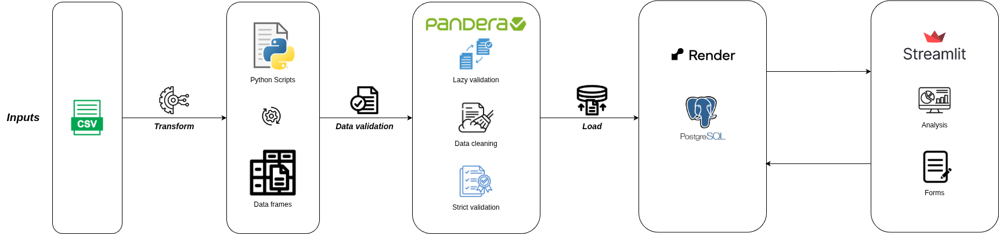
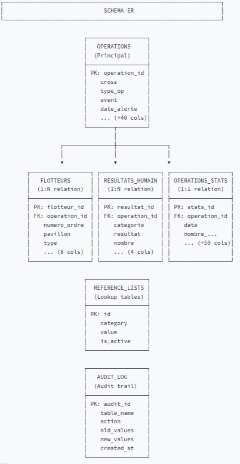

# 🌊 Pipeline ETL - Données de Sauvetage Maritime SECMAR

[](https://www.python.org/downloads/)
[](https://www.postgresql.org/)
[](https://streamlit.io/)
[](tests/)
[](LICENSE)

## 📋 Description

Ce projet implémente un **pipeline ETL (Extract, Transform, Load)** complet pour centraliser et analyser les données historiques des opérations de sauvetage maritime. Le système fonctionne en **4 étapes principales** :

1. **Extraction** : Lecture des fichiers CSV contenant les opérations historiques (15,000+ enregistrements depuis 1985)
2. **Nettoyage & Validation souple** : Détection des anomalies et transformation des données pour assurer la cohérence (validation Lazy pour tout voir)
3. **Validation stricte** : Utilisation de Pandera pour vérifier le respect des règles métier (types, énumérations, plages de valeurs)
4. **Chargement** : Insertion optimisée dans PostgreSQL avec création des 26 indexes de performance

Une interface Streamlit interactive permet aux équipes métier de consulter, modifier, analyser et exporter les données de manière intuitive (sans code SQL). **Chaque modification (création, édition, suppression)** est enregistrée automatiquement dans une **table audit_log** pour assurer la traçabilité complète et la conformité.

### 🎯 Objectifs du projet

- **Centraliser** les données historiques de sauvetage maritime (15,000+ opérations depuis 1985) : Récupération d'archives CSV éparpillées et consolidation dans une seule base de données
- **Normaliser** les formats de données hétérogènes provenant de sauvegardes CSV : Harmonisation des colonnes, types, énumérations (ex: SAR, MAS, DIV pour les types d'opération)
- **Valider** les données en trois étapes stratégiques :  
  ***Validation initiale en mode lazy*** (`lazy=True`) : Détection et listing de **toutes les erreurs** sans interruption pour avoir une vue complète des problèmes.  
  ***Nettoyage des données*** : Correction ou transformation des erreurs identifiées (ex: normalisation des dates, remplissage des valeurs manquantes).  
  ***Validation stricte finale*** (`lazy=False`, Fast-Fail) : Vérification que toutes les règles métier sont respectées, avec rejet immédiat des données non conformes.
- **Stocker** les données dans PostgreSQL avec 26+ indexes de performance : Optimisation des requêtes par thème (alertes, zones géographiques, flotteurs, etc.)
- **Visualiser** via dashboards analytiques : 6 analyses thématiques pour explorer les opérations par différents angles
- **Gérer** les données via CRUD complet avec audit logging : Création, lecture, modification, suppression d'opérations + historique complet de qui a fait quoi et quand
- **Assurer la traçabilité** via table audit_log : Enregistrement automatique de **CHAQUE modification** (INSERT/UPDATE/DELETE) avec timestamp, avant/après valeurs, et action effectuée - utile pour conformité, debugging, et replay historique
- **Garantir** la qualité avec suite de tests unitaires
---

## 🛠️ Technologies utilisées

### Langages et frameworks

- **Python 3.13+** - Langage principal
- **pandas** - Manipulation et transformation de données
- **Psycopg2** - Driver PostgreSQL natif
- **SQLAlchemy** - ORM et gestion connexions
- **Streamlit 1.0+** - Interface web multi-pages
- **Pandera** - Validation de schémas stricte

### Outils de développement

- **pytest** - Framework de tests 
- **pytest-cov** - Couverture de code
- **python-dotenv** - Gestion variables d'environnement
- **Uvicorn** – Serveur ASGI léger pour exécuter l’application web / API FastAPI  


### Base de données et déploiement

- **PostgreSQL 12+** - SGBDR relationnel
- **Git/GitHub** - Gestion de version
- **Render** - Hébergement de la base de données et déploiement  
---

## 🔄 Architecture globale
La **Plateforme de Gestion des Opérations Maritimes SECMAR** est une solution complète permettant :  

- **Centralisation** des données historiques de sauvetage maritime  
- **Nettoyage et validation** des données avec rejet automatique des anomalies (Fast-Fail / Lazy Validation selon le contexte)  
- **Gestion CRUD** interactive via une interface Streamlit  
- **Administration et audit** pour contrôler, superviser les opérations CRUD et assurer la traçabilité  
- **Analyse et visualisation** des opérations de sauvetage via dashboards analytiques  


### Contexte métier

Le département en charge du suivi des opérations de surveillance et de sauvetage maritimes a perdu ses données suite à des problèmes techniques. Cette solution :
- ✅ Reconstitue l'historique depuis des sauvegardes CSV
- ✅ Centralise les données dans PostgreSQL
- ✅ Permet la mise à jour, création, modification, suppression d'opérations
- ✅ Génère des rapports analytiques par thématique
- ✅ Enregistre l'audit de toutes les modifications

### Caractéristiques principales

| Aspect | Détail |
|--------|--------|
| **Base de données** | PostgreSQL avec 26+ indexes de performance |
| **Pipeline ETL** | Pandas + Psycopg2, validation stricte/lazy |
| **Interface** | Streamlit 1.0+ multi-pages avec dashboard analytique |
| **Audit** | Logging complet de tous les CRUD |
| **Tests** | Suite complète pytest |
| **Performance** | Pagination, cache Redis-like, indexes optimisés |

---

## 🏗️ Structure globale du projet

```
Brief-3-Gestion-donnees-et-UI-analytique-polyvalente-Grass-Squad/
├── src/
│   ├── config.py                    # Configuration chemins
│   ├── io_pipeline.py               # I/O générique (CSV,API,..)
│   ├── app/                         # Interface Streamlit multi-pages
│   │   ├── home.py                  # Page d'accueil
│   │   ├── pages/
│   │   │   ├── 01_Dashboard.py      # Dashboards analytiques
│   │   │   ├── 02_Operations.py     # CRUD Opérations
│   │   │   ├── 03_Audit.py          # Historique des modifications
│   │   │   ├── 04_Admin.py          # Gestion listes de référence(listes des valeurs prédéfinies pour certains champs)
│   │   │   └── 05_Schema.py         # Schéma BD avec diagrammes
│   │   ├── views/                   # Vue métier (list, create, edit, delete)
│   │   ├── components/              # Composants réutilisables
│   │   ├── utils/                   # Utilitaires (data_loader, queries, formatters)
│   │   └── assets/                  # CSS personnalisé
│   │
│   ├── analysis/                    # Analyses par thématique
│   │   ├── dashboard_analytics.py   # Vue d'ensemble
│   │   ├── alerte_analysis.py       # Analyses alertes
│   │   ├── date_analysis.py         # Analyses temporelles
│   │   ├── zone_analysis.py         # Analyses géographiques
│   │   ├── flotteurs_analysis.py    # Analyses navires
│   │   ├── meteo_analysis.py        # Analyses météo
│   │   └── resultats_humain_analysis.py
│   │
│   ├── cleaning/                    # Nettoyage des données
│   │   ├── transformation.py        # Fonctions de transformation
│   │   └── transformation_params.py # Configuration par table
│   │
│   ├── validation/                  # Validation des données
│   │   ├── schemas_validation.py    # Définition schémas Pandera
│   │   └── run_validation.py        # Orchestration validation
│   │
│   ├── ingestion/                   # Chargement données brutes
│   │   └── load_raw_data.py         # Lecture CSV/Parquet
│   │
│   ├── crud/                        # Opérations base de données
│   │   ├── operations_crud.py       # CRUD Opérations
│   │   ├── flotteurs_crud.py        # CRUD Flotteurs
│   │   ├── resultats_humain_crud.py # CRUD Résultats humains
│   │   ├── operations_stats_crud.py # CRUD Stats
│   │   ├── audit_crud.py            # CRUD Audit logs
│   │   └── reference_lists_crud.py  # CRUD Listes de référence
│   │
│   └── database/                    # Base de données
│       ├── database.sql             # Schéma et indexes (260 lignes)
│       ├── reference_lists.sql      # Tables de codes
│       ├── init_reference_lists.py  # Initialisation automatique
│       └── load_database.py         # Connexion et chargement
│
├── data/
│   ├── raw/                         # Données brutes CSV
│   │   ├── operations.csv
│   │   ├── flotteurs.csv
│   │   ├── resultats_humain.csv
│   │   └── operations_stats.csv
│   ├── processed/                   # Données nettoyées (pipeline)
│   └── rejected/                    # Données rejetées (validation échouée)
│
├── tests/                           # Tests unitaires
│   ├── test_cleaning.py             # Tests nettoyage
│   ├── test_ingestion.py            # Tests ingestion
│   └── test_validation.py           # Tests validation
│
├── run_pipeline.py                  # Point d'entrée ETL
├── requirements.txt                 # Dépendances
├── pyproject.toml                   # Configuration projet
├── .env                             # Variables d'environnement
├── .streamlit/config.toml           # Configuration Streamlit
└── README.md                        # Ce fichier
```

---

## Architecture ETL



---

## 🔄 Pipeline ETL

### Étape 1 : Ingestion (`src/ingestion/`)

Charge les 4 sources de données brutes :

| Fichier | Lignes | Colonnes | Format |
|---------|--------|----------|--------|
| operations.csv | 15,000+ | 26 | CSV |
| flotteurs.csv | 8,500+ | 7 | CSV |
| resultats_humain.csv | 18,000+ | 4 | CSV |
| operations_stats.csv | 15,000+ | 60+ | CSV |

**Code :**
```python
from src.ingestion.load_raw_data import load_all_raw_data
dataframes = load_all_raw_data()
```

### Étape 2 : Validation souple (Lazy) & Nettoyage (`src/cleaning/`)

Cette étape utilise une stratégie **hybride** :
- **Validation souple** avec **Pandera** (`lazy=True`) : Parcourt les données, collecte **toutes les erreurs** (pas d'interruption) pour avoir une vision complète des problèmes
- **Nettoyage et transformation** : Applique les transformations métier pour corriger les anomalies identifiées
- **Sauvegarde des rejetés** : Les lignes non nettoyables sont archivées dans `data/rejected/` avec timestamp pour audit

Transformations appliquées par table :

#### Operations
- Normalisation des colonnes (minuscules, underscores)
- Validation `operation_id > 0` (rejet stricte)
- Conversion des dates en ISO8601
- Nettoyage des chaînes (trim, None normalisé)
- Remplissage des colonnes manquantes avec défauts

#### Flotteurs
- Filtre `operation_id > 0`
- Validation `numero_ordre >= 1`
- Énumération des résultats (Assisté, Remorqué, etc.)
- Suppression des doublons

#### Résultats Humains
- Filtre `operation_id > 0`
- Énumération des catégories et résultats
- Validation `nombre >= 0`
- Séparation des clandestins

#### Operations Stats
- Filtre `operation_id > 0`
- Validation des entiers (années, mois, jour)
- Normalisation des coordonnées (latitude, longitude)
- Agrégations des statistiques humaines

**Rejet automatique :** Les lignes invalides sont sauvegardées dans `data/rejected/` avec timestamp.

### Étape 3 : Validation stricte (Fast-Fail) (`src/validation/`)

Cette étape applique une **validation stricte** avec **Pandera** en mode `fail-fast` (`lazy=False`) :

```python
from src.validation.schemas_validation import OperationsSchema
schema = OperationsSchema()
validated_df = schema.validate(df_operations, lazy=False)  # Arrête à la première erreur
```

Cette validation stricte vérifie **5 catégories de contraintes** :
- **Types de données** : INT, VARCHAR, TIMESTAMP, NUMERIC, BOOLEAN (erreur si mauvais type)
- **Contraintes de plage** : min/max pour chaque colonne numérique (ex: `0 <= latitude <= 90`)
- **Énumérations** : Valeurs autorisées pour certains champs (ex: type_operation ∈ [SAR, MAS, DIV, SUR, POL])
- **Non-nullabilité** : Colonnes obligatoires marquées NOT NULL
- **Unicité des clés** : Identifiants uniques (PK, clés composites)

Les données qui passent cette validation sont prêtes pour la production.

### Étape 4 : Chargement & Indexation (`src/database/`)

Cette étape charge les données validées dans PostgreSQL avec une stratégie de **performance optimale** :

```python
insert_with_copy(
    engine,
    df_operations,
    table_name='operations',
    if_exists='append'  # Ajoute aux données existantes
)
```

**Stratégie** :
- **COPY natif PostgreSQL** : Insertion en masse très rapide (15,000 lignes < 2 secondes)
- **Indexes post-insertion** : Les 26 indexes sont créés APRÈS le chargement pour éviter de ralentir l'insertion
- **Transactions** : Tout ou rien - soit tout se charge, soit rien (intégrité garantie)

## 💾 Structure de la base de données

### Schéma ER (Entity-Relationship)



### Indexes pour la performance (26 total)

Les indexes permettent à PostgreSQL de trouver les données rapidement sans scanner toute la table :

**Indexes simples (single-column) :**
- `idx_operations_type_operation`, `_cross`, `_departement`, `_date_reception`, etc.
- Accélèrent les filtres par un seul critère

**Indexes composites (2-3 colonnes) :**
- `idx_operations_cross_date` - Requêtes CROSS + date (ex: "toutes les opérations de Gris-Nez en 2023")
- `idx_operations_dept_date` - Requêtes département + date (ex: "toutes les opérations en Seine-Maritime en mai")
- `idx_flotteurs_type_resultat` - Analyses navires (ex: "tous les navires avec résultat 'Remorqué'")
- `idx_flotteurs_operation_ordre` - Clé composée (operation_id, numero_ordre) pour les relations

**Indexes spatiaux :**
- `idx_operations_lat_long` - Requêtes géographiques pour les cartes et heatmaps (ex: "toutes les opérations dans un rectangle [lat, long]")

## 🎨 Interface Streamlit

### Architecture multi-pages

Streamlit organise l'application en **6 pages indépendantes**, accessibles via le menu latéral :

#### 🏠 Page d'accueil (`home.py`)

- **Vue d'ensemble avec 4 KPIs** : Nombre total d'opérations, de flotteurs, de personnes secourues, etc.
- **Accès rapide aux 5 sections principales** : Navigation vers Dashboard, Opérations, Audit, Admin, Schéma
- **Diagramme de l'architecture BD** : Visualisation simple des tables et relations
- **Menu latéral masqué** : Sidebar réduit par défaut pour maximiser l'espace d'affichage

#### 📊 Dashboard analytique (`pages/01_Dashboard.py`)

Page interactive pour **explorer les données sous 6 angles différents**. Sélectionnez un thème via des boutons :

- **Alertes** : Types d'opérations, moyens d'alerte utilisés, autorités impliquées
- **Temporalité & Saisonnalité** : Calendrier de l'année, tendances mensuelles (pics d'été, creux d'hiver)
- **Zones géographiques** : Heatmap des opérations, couverture par CROSS, densité par département
- **Flotteurs** : Catégories de navires impliqués, résultats (Assisté/Remorqué/etc.), pavillons des navires
- **Météorologie** : Conditions de vent, état de la mer, conditions d'alerte
- **Résultats humains** : Nombre de personnes secourues, blessées, décédées, par catégorie

Chaque analyse inclut des **graphiques interactifs** (Plotly) et des **statistiques clés**.

#### 🚢 Opérations (`pages/02_Operations.py`)

Page complète pour **gérer les opérations** (CRUD = Create, Read, Update, Delete).

**Vue Liste :**
- **Pagination** : Affiche 10-100 lignes par page (sélectionnable)
- **Recherche multi-critères** : Filtre par operation_id, CROSS, type d'opération, département, etc.
- **Tri personnalisable** : Cliquez sur l'entête de colonne pour trier (croissant/décroissant)
- **Bouton rafraîchir** : Réinitialise tous les filtres et rechargent les données

**Opérations CRUD :**
- **➕ Créer** : Formulaire complet avec champs obligatoires et validation métier avant insertion
- **👁️ Consulter (View)** : Affiche tous les détails : opération + flotteurs associés + résultats humains + statistiques + historique audit
- **✏️ Modifier (Edit)** : Édition in-place avec vérification de cohérence (ex: vérifier que les personnes secourues ≤ personnes impliquées)
- **🗑️ Supprimer (Delete)** : Confirmation double-clic + suppression cascade des flotteurs et résultats liés

#### 🛡️ Audit (`pages/03_Audit.py`)

Page de **conformité et traçabilité** : enregistrement complet de qui a fait quoi.

- **Historique complet** : Chaque insertion, modification, suppression est enregistrée avec timestamp
- **Filtres avancés** : Filtrez par table affectée, type d'action (INSERT/UPDATE/DELETE), plage de dates, etc.
- **Affichage avant/après** : Voyez exactement ce qui a changé en JSON (les valeurs avant et après la modification)
- **Export CSV** : Téléchargez l'historique pour archivage ou analyse externe

#### ⚙️ Admin (`pages/04_Admin.py`)

Page **administrative** pour maintenir les données de référence.

- **Gestion des listes** : CROSS (Gris-Nez, Corsen, etc.), types d'événements, autorités impliquées, types de flotteurs
- **Opérations** : Ajouter/Modifier/Supprimer/Activer ou désactiver une valeur de référence
- **Initialisation auto** : Au premier lancement, les listes sont automatiquement remplies avec les valeurs SECMAR standards

#### 📐 Schéma (`pages/05_Schema.py`)

Page **technique** pour explorer la structure de la base de données.

- **Diagramme ER** : Visualisation graphique des tables et relations (créé avec Mermaid)
- **Détails colonne par colonne** : Pour chaque table, affiche chaque colonne avec son type, contraintes, description
- **Types et contraintes** : Voir les énumérations, plages de valeurs, colonnes obligatoires
- **Indexes** : Liste des indexes avec les colonnes impliquées pour comprendre l'optimisation

## 🧪 Tests unitaires

Lancez la suite complète :
```bash
pytest tests/ -v --cov=src --cov-report=html
```

### Fichiers de test

#### `tests/test_cleaning.py` (50+ tests)

Teste les fonctions de nettoyage et transformation :
- **Normalisation colonnes** : Colonnes en minuscules, espaces trim
- **Filtrage operation_id** : Rejet des IDs <= 0 ou NULL
- **Nettoyage strings** : Suppression espaces, normalisation encodage
- **Conversion dates** : Parsing de formats variés vers ISO8601
- **Remplissage défauts** : Valeurs par défaut pour colonnes manquantes
- **Rejet automatique** : Lignes non nettoyables sont sauvegardées avec timestamps

#### `tests/test_ingestion.py` (15+ tests)

Teste le chargement des données brutes :
- **Chargement CSV** : Vérifie que les fichiers CSV sont correctement parsés
- **Format Parquet** : Supporte aussi le format Parquet (plus rapide qu'CSV)
- **Intégrité lignes** : Nombre de lignes correct, pas de doublons accidentels

#### `tests/test_validation.py` (25+ tests)

Teste les schémas Pandera et contraintes métier :
- **Schémas Pandera** : Types de données corrects (INT vs VARCHAR, TIMESTAMP, etc.)
- **Énumérations** : Valeurs énumérées correctes (type_operation ∈ [SAR, MAS, DIV, SUR, POL])
- **Plages de valeurs** : Min/Max respectés (latitude ∈ [-90, 90], longitude ∈ [-180, 180])
- **Types de données** : Erreur si type incorrect (ex: chaîne dans colonne INT)

---

## 📚 Documentation des données

### Métadonnées SECMAR

Les données proviennent du **système SECMAR** (Système Electronique Centralisé de suivi Maritime) qui archive tous les appels de détresse et opérations de sauvetage depuis 1985.

Source officielle : https://mtes-mct.github.io/secmar-documentation/


## 💾 Installation

### Prérequis

- Python 3.13+
- PostgreSQL 12+
- pip ou Poetry

### Étapes d'installation

#### 1. Cloner le repository

```bash
git clone https://github.com/Simplon-DE-P1-2025/Brief-3-Gestion-donnees-et-UI-analytique-polyvalente-Grass-Squad.git
cd Brief-3-Gestion-donnees-et-UI-analytique-polyvalente-Grass-Squad
```

#### 2. Créer un environnement virtuel

```bash
python3.13 -m venv .venv
source .venv/bin/activate  # Linux/Mac
# ou
.venv\Scripts\activate  # Windows
```

#### 3. Installer les dépendances

```bash
pip install -r requirements.txt
```

#### 4. Configurer l'environnement

Créer un fichier `.env` à la racine :

```env
# Configuration PostgreSQL
DB_HOST=localhost
DB_PORT=5432
DB_DATABASE=sauvetage_db
DB_USER=sauvetage_db_user
DB_PASSWORD=votre_mot_de_passe
```

#### 5. Initialiser la base de données

```bash
createdb sauvetage_db -U postgres
python run_pipeline.py
```

---

## 🚀 Utilisation

### Lancer le pipeline ETL

```bash
python run_pipeline.py
```

**Sortie attendue :**
```
[1/4] Ingestion des données...
      
[2/4] Nettoyage et validation...
      
[3/4] Chargement dans PostgreSQL...
      
[4/4] Tests de validation...
```

### Lancer l'interface Streamlit

```bash
streamlit run src/app/home.py
```

L'application s'ouvre à `http://localhost:8501`

---

---
### Variables d'environnement

```env
# Base de données (PostgreSQL)
DB_HOST=localhost
DB_PORT=5432
DB_USER=postgres
DB_PASSWORD=***
DB_DATABASE=grass_squad

# Streamlit
STREAMLIT_PORT=8501
STREAMLIT_CLIENT_LOGGER_LEVEL=info
```
## 👥 Équipe

### Wickets Sprinters : **Kaouter** | **Caroline** | **Zoubir**  
---

## 📝 Licence

Ce projet est développé dans le cadre d'une formation à Simplon.


---

<div align="center">
  <strong>Développé avec passion </strong>
  <br>
  <sub>Projet Simplon - Data Engineering - 2025</sub>
</div>

